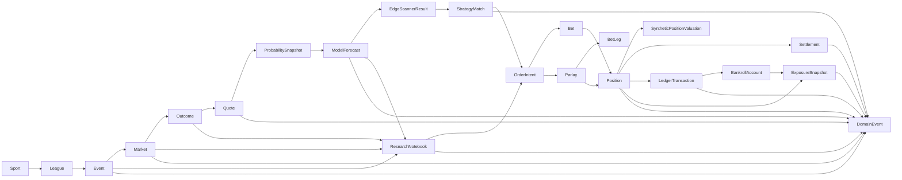

# SIP Terminal Design Milestone

## Goal
Reframe SIP as a Bloomberg-style sports markets intelligence terminal where positions are thesis-expression instruments, not product identity.

Core lifecycle:

Observe -> Scan -> Investigate -> Forecast -> Express Position -> Monitor -> Resolve -> Learn

## 1. Updated Domain Map



Separation constraints:
- Market probability and SIP probability are independent fields in `ProbabilitySnapshot`.
- Actual cash accounting remains in `BankrollAccount` + `LedgerTransaction`.
- Synthetic valuation remains in `SyntheticPositionValuation` and never mutates cash balances.
- Position mode is explicit: `practice` or `recorded_real`.
- Straight and parlay flows are distinct aggregates.

## 2. Database Schema (Terminal-Oriented)

### Core market intelligence tables
- `sip_event_catalog`
- `sip_markets`
- `sip_outcomes`
- `sip_market_quotes`
- `sip_probability_snapshots`
- `sip_model_forecasts_v2`

### Edge scanner + strategy tables
- `sip_strategy_definitions`
- `sip_strategy_matches`
- `sip_edge_scanner_results`

### Research notebook tables
- `sip_research_notebooks`
- `sip_research_notes`
- `sip_research_attachments`
- `sip_research_evidence_links`

### Position/thesis and accounting tables
- `sip_order_intents`
- `sip_bets_v2`
- `sip_parlays`
- `sip_bet_legs`
- `sip_positions`
- `sip_synthetic_position_valuations`
- `sip_bankroll_accounts`
- `sip_ledger_transactions`
- `sip_settlements_v2`
- `sip_exposure_snapshots`

### Immutable eventing + audit tables
- `sip_domain_events`
- `sip_audit_log`

Required storage rules:
- No destructive update for settlements/ledger rows.
- Edit actions emit new aggregate version + domain event + audit record.
- Domain event hash chain (`payload_hash`, `previous_event_hash`, `event_hash`) is mandatory.

## 3. Edge Scanner Scoring Contract

`EdgeScannerResult` fields:
- `id`, `as_of`, `strategy_id`, `strategy_version`
- `rank_mode` enum:
  - `largest_probability_disagreement`
  - `highest_expected_value`
  - `highest_confidence_adjusted_edge`
  - `best_data_quality`
  - `largest_cross_book_disagreement`
  - `largest_recent_line_movement`
  - `strongest_model_stability`
  - `lowest_current_exposure`
  - `closing_soon`
- `market_id`, `outcome_id`, `league`, `event_id`, `market_type`
- `best_book`, `best_odds_american`, `best_odds_decimal`
- `raw_implied_probability`, `no_vig_consensus_probability`, `sip_probability`
- `absolute_disagreement`
- `expected_value`
- `confidence_adjusted_edge`
- `data_quality_status`
- `quote_freshness_seconds`
- `market_movement_score`
- `time_to_close_seconds`
- `strategy_tags` (string array)
- `current_exposure`
- `qualification_status`
- `rank_explanation` (required text)

Reference formulas:
- `absolute_disagreement = abs(sip_probability - no_vig_consensus_probability)`
- `expected_value = (sip_probability * decimal_odds) - 1`
- `confidence_adjusted_edge = absolute_disagreement * model_confidence * data_quality_factor`

## 4. Strategy Definition Contract

`StrategyDefinition`:
- `id`, `name`, `description`
- `domain`, `leagues`, `eligible_market_types`
- `filters` (json)
- `ranking_formula` (dsl string)
- `required_features` (array)
- `required_evidence` (array)
- `minimum_data_quality`
- `minimum_sportsbook_coverage`
- `exposure_limits` (json)
- `entry_rules` (array)
- `no_position_rules` (array)
- `exit_rules` (array)
- `model_versions` (array)
- `strategy_version`
- `created_at`, `updated_at`

`StrategyMatch`:
- `id`, `strategy_id`, `strategy_version`
- `market_id`, `outcome_id`
- `matched_at`
- `score_breakdown` (json)
- `explanation` (required)
- `status` (`qualified`, `no_position`, `invalidated`)

## 5. Research Notebook Schema

`ResearchNotebook`:
- `id`, `title`, `scope_type`, `scope_id`, `status`, `created_at`, `updated_at`

`ResearchNote`:
- `id`, `notebook_id`, `note_type`, `title`, `body`, `author`, `confidence`, `created_at`
- `supersedes_note_id`
- `model_version`, `strategy_version`
- `market_snapshot_id`, `feature_snapshot_id`

`ResearchAttachment`:
- `id`, `note_id`, `attachment_type`, `reference`, `content_hash`, `metadata`

`EvidenceLink`:
- `id`, `note_id`, `evidence_id`
- `stance` enum: `supporting`, `contradicting`, `contextual`, `uncertain`
- `relevance`, `independence`, `observed_at`

Versioning rule:
- Note edits create a new note row that references prior row via `supersedes_note_id`.

## 6. Market Intelligence Page Contract

`GET /api/v1/markets/{market_id}/workspace`

Response sections:
- `market`
- `outcomes`
- `consensus`
- `probability_history`
- `odds_history`
- `model_versions`
- `feature_changes`
- `context_events` (news, injuries, lineups, rest)
- `supporting_factors`
- `contradicting_factors`
- `strategy_matches`
- `research_notebook`
- `open_positions`
- `exposure`
- `event_log`
- `settlement_rules`

## 7. Position/Thesis Contract

`PositionThesisExpression`:
- `position_id`, `mode`
- `market_id`, `outcome_id`
- `stake`, `synthetic_size`
- `accepted_odds_american`, `accepted_odds_decimal`
- `market_probability_at_entry`, `sip_probability_at_entry`
- `edge_at_entry`, `expected_value_at_entry`
- `model_version`, `strategy_id`, `strategy_version`
- `notebook_id`, `thesis_note_id`
- `confidence`
- `invalidation_conditions`
- `exposure_before`, `exposure_after`
- `entered_at`
- `settlement`
- `postmortem_note_id`

Synthetic valuation fields:
- `entry_probability`
- `synthetic_shares = stake / entry_probability`
- `current_market_probability`
- `current_sip_probability`
- `estimated_market_value = synthetic_shares * current_market_probability`
- `estimated_sip_value = synthetic_shares * current_sip_probability`
- `estimated_change_since_entry`

## 8. Event-Log Taxonomy

Domain event envelope:
- `id`, `aggregate_type`, `aggregate_id`, `event_type`, `event_version`
- `occurred_at`, `recorded_at`
- `actor_type`, `actor_id`
- `correlation_id`, `causation_id`
- `payload`, `payload_hash`, `previous_event_hash`, `event_hash`
- `source`, `model_version`, `schema_version`

Required event types:
- Quote: `quote_observed`, `quote_stale`, `consensus_changed`
- Model: `forecast_created`, `forecast_updated`, `model_probability_updated`, `feature_snapshot_recorded`
- Strategy: `strategy_match_created`, `edge_rank_changed`
- Research: `notebook_created`, `note_created`, `note_revised`, `evidence_linked`
- Positioning: `order_intent_created`, `bet_recorded`, `bet_edited`, `parlay_leg_added`, `parlay_leg_removed`, `position_created`, `position_updated`
- Risk/accounting: `stake_reserved`, `exposure_recalculated`, `ledger_adjusted`
- Market lifecycle: `market_suspended`, `market_closed`, `result_ingested`, `settlement_started`, `settlement_completed`, `settlement_reversed`, `postmortem_completed`

## 9. FastAPI Endpoint Map

Primary workflow navigation:
- `GET /api/v1/overview`
- `GET /api/v1/markets`
- `GET /api/v1/edge-scanner`
- `GET /api/v1/strategies`
- `GET /api/v1/research/notebooks`
- `GET /api/v1/watchlists`
- `GET /api/v1/positions`
- `GET /api/v1/portfolio`
- `GET /api/v1/exposure`
- `GET /api/v1/performance`
- `GET /api/v1/activity`
- `GET /api/v1/models`
- `GET /api/v1/data-health`

Detailed map is in `docs/sip_terminal_fastapi_map.yaml`.

## 10. Execution Adapter Design

Execution is a thesis-expression workflow, not the primary product identity.

### Order State Machine
States:
- `draft`
- `validated`
- `pending_confirmation`
- `ready_to_submit`
- `submitted`
- `awaiting_external_confirmation`
- `accepted`
- `rejected`
- `failed`
- `canceled`

Allowed flow:

```text
draft -> validated -> pending_confirmation -> ready_to_submit -> submitted -> accepted/rejected/failed
                                     \-> canceled
ready_to_submit -> submitted -> awaiting_external_confirmation -> accepted/rejected/failed
```

### Execution Modes
- `practice`: records a practice position and ledger reservation without external execution.
- `manual_record`: waits for explicit confirmation before submission.
- `prefilled_link`: generates a sportsbook link, then waits for external confirmation.
- `direct_auto`: only activates when an authorized transactional sportsbook API is explicitly available.

### Receipts
Receipts are immutable evidence records attached to each execution order:
- validation
- confirmation
- submission
- provider response
- prefilled link
- failure

### Failure Handling
Failures are append-only and transition the order to `failed` or `rejected`.
Failure codes must be explicit, including:
- adapter unavailable
- direct not authorized
- provider rejected
- provider timeout
- confirmation required
- invalid transition

### Design Constraints
- Practice positions must work without external sportsbook execution.
- Manual recording must require confirmation.
- Prefilled sportsbook links must be supported before direct execution exists.
- Direct automatic execution must remain disabled unless a transactional sportsbook API is authorized.

## 11. UI Wireframes

### A. Markets Terminal
```text
+--------------------------------------------------------------------------------+
| NAV: Overview | Markets | Edge Scanner | Strategies | Research | Positions ... |
+--------------------------------------------------------------------------------+
| Filters: sport league date team player market-type status book data-quality     |
| Search: [..........................] Sort: [start|edge|ev|freshness|exposure]   |
+--------------------------------------------------------------------------------+
| Event / Market                            | Market Prob | SIP Prob | Edge | EV  |
| WNBA: Sky @ Liberty - Moneyline (Home)    | 48.0%       | 56.0%    | +8pp | 0.12|
| WNBA: Sky @ Liberty - Player Pts Over 24.5| 50.1%       | 44.2%    | -5.9 | -0.08|
| MLB: Mets @ Dodgers - Total Over 8.5      | 51.2%       | 54.1%    | +2.9 | 0.05|
+--------------------------------------------------------------------------------+
| Right pane: Position Ticket + Existing Exposure + Market/Model movement sparkline|
+--------------------------------------------------------------------------------+
```

### B. Edge Scanner
```text
+--------------------------------------------------------------------------------+
| Ranking mode [confidence-adjusted-edge]  Strategy [model-vs-market-disagreement]|
+--------------------------------------------------------------------------------+
| Rank | League | Event | Market | Outcome | Best Odds | Mkt | SIP | Abs | EV ...|
| 1    | WNBA   | ...   | ML     | Home    | -118 DK   | 48% | 56% | 8%  | 0.12   |
| why: High disagreement, stable model, low current exposure, strong data quality |
+--------------------------------------------------------------------------------+
```

### C. Strategy View
```text
+-------------------------------------------------------------------------------+
| Strategy: Undervalued Underdogs v3                                            |
| Domain: WNBA, MLB   Markets: moneyline spread   Min quality: verified         |
| Ranking formula DSL                                                            |
| Entry rules | No-position rules | Exit rules | Exposure limits                 |
| Current matches (explainable)                                                  |
+-------------------------------------------------------------------------------+
```

### D. Market Intelligence Workspace
```text
+--------------------------------------------------------------------------------+
| Market Header + Status + Time to close + Coverage + Open exposure              |
+--------------------------------------------------------------------------------+
| Consensus vs SIP | Probability history chart | Odds history chart              |
| Model version timeline | Feature deltas | Context events                        |
| Supporting factors | Contradicting factors | Strategy matches                   |
| Research notebook (linked) | Open positions | Event log | Settlement rules      |
+--------------------------------------------------------------------------------+
```

### E. Research Notebook
```text
+--------------------------------------------------------------------------------+
| Notebook title + scope (event/market/forecast/strategy/position/settlement)    |
+--------------------------------------------------------------------------------+
| Notes timeline (versioned)                                                     |
| - Hypothesis | - Supporting evidence | - Contradicting evidence                |
| - Assumptions | - Invalidation criteria | - Post-settlement review             |
| Attachments + Evidence links                                                    |
+--------------------------------------------------------------------------------+
```

### F. Portfolio and Exposure
```text
+--------------------------------------------------------------------------------+
| Opening BR | Deposits | Withdrawals | Available | Reserved | Open Stake         |
| Max Loss | Max Profit | Realized P/L | Unrealized Market | Unrealized SIP       |
+--------------------------------------------------------------------------------+
| Exposure cube: league team player event market type sportsbook outcome horizon  |
| Open positions table: entry edge vs current edge, entry odds vs current odds    |
| Settled positions table: payout, realized P/L, thesis accuracy                  |
+--------------------------------------------------------------------------------+
```

## Non-goals for this milestone
- No automatic sportsbook execution adapter.
- No P2P matching, no tradable token abstraction, no blockchain settlement.
- No synthetic valuation mixing into cash ledger.
